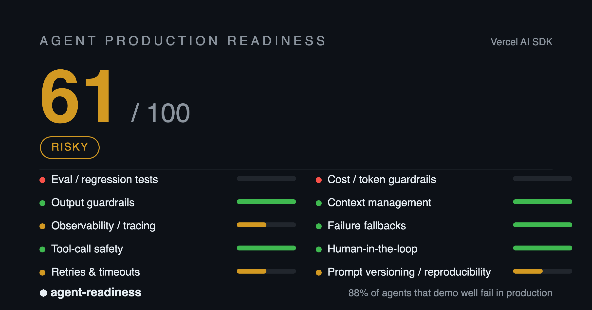

<div align="center">

# 🛡️ agent-readiness

**Score your AI agent's production-readiness in 60 seconds.**

_88% of AI agents that demo well fail in production. Find out if yours will — before you ship._

[](LICENSE)
[](https://nodejs.org)
[](package.json)
[](#contributing)

```bash
npx agent-readiness
```



</div>

---

## Why

AI agents look great in demos and fall apart in production — hallucinations, runaway token bills, silent tool-call failures, and no way to tell if last week's prompt tweak made things worse. Reported production failure rates run **70–95%**, with cleanup and lost-trust costs reaching six figures per project.

`agent-readiness` statically scans your repo and scores it across the **10 dimensions that separate a demo from a system you can trust** — so you find the gaps before your users do.

## Quick start

```bash
# scan the current project
npx agent-readiness

# scan a specific path
npx agent-readiness ./my-agent
```

No config. No runtime dependencies. Works in any JS/TS or Python agent repo.

## What it checks

| Dimension | Why it matters |
| --- | --- |
| 🧪 **Eval / regression tests** | Know if a change made the agent worse |
| 🛡️ **Output guardrails** | Stop hallucinated / malformed output reaching users |
| 🔭 **Observability** | See *where* a run failed |
| 🔧 **Tool-call safety** | Typed schemas + guarded execution |
| 🔁 **Retries & timeouts** | Survive flaky models and downstream services |
| 💸 **Cost guardrails** | No surprise five-figure bills |
| 🧠 **Context management** | Avoid context bloat and quality collapse |
| 🪂 **Failure fallbacks** | One bad step shouldn't kill the chain |
| 🙋 **Human-in-the-loop** | Approval before high-risk actions |
| 📌 **Prompt versioning** | Reproducible, roll-back-able behavior |

Each dimension is weighted by how often it causes production incidents (weights sum to 100):

> 🟢 **80–100** ship it · 🟡 **60–79** patch first · 🔴 **&lt;60** not ready

## Real-world example

It gives an honest read on real projects — even popular ones:

> **`vercel/ai-chatbot` scores 61/100**, correctly flagging its missing eval suite and cost guardrails.

That's the point: if a widely-used project has gaps, yours probably does too.

## Use in CI

Gate pull requests on readiness:

```yaml
# .github/workflows/agent-readiness.yml
name: Agent Readiness
on: [pull_request]
jobs:
  readiness:
    runs-on: ubuntu-latest
    steps:
      - uses: actions/checkout@v4
      - uses: actions/setup-node@v4
        with:
          node-version: 22
      - run: npx agent-readiness --min 70   # fails the build below 70
```

## Add a badge

```bash
npx agent-readiness --badge
# → 
```

## All commands

```bash
npx agent-readiness                 # scan current directory
npx agent-readiness ./my-agent      # scan a specific path
npx agent-readiness --json          # machine-readable output
npx agent-readiness --badge         # print a README badge
npx agent-readiness --min 70        # exit 1 if score < 70 (CI gate)
npx agent-readiness --svg           # write a shareable score card (SVG)
npx agent-readiness --no-survey     # skip interactive questions
```

## Supported frameworks

Vercel AI SDK · LangGraph · OpenAI Agents SDK · LangChain · Mastra · CrewAI · AutoGen · LlamaIndex · Pydantic AI

JS/TS is first-class; Python is best-effort. Custom / unknown projects still work.

## How it works & limitations

`agent-readiness` is **heuristic** — it reads your dependencies and source patterns (and ignores comments to avoid false positives). It's a fast **indicator, not a formal audit**: it checks whether a safeguard *exists*, not how good it is. AST-level analysis and runtime checks are on the roadmap.

That honesty cuts both ways — a high score means you've wired up the basics, not that you're bulletproof.

## Contributing

Issues and PRs welcome — especially new checks, framework adapters, and accuracy fixes:

```bash
npm install
npm test
npm run selftest
```

## License

MIT © [YOMXXX](mailto:316195542@qq.com)

---

<div align="center">
<sub>Shipping an agent to production? <a href="mailto:316195542@qq.com">Get a human deep-dive audit →</a></sub>
</div>
